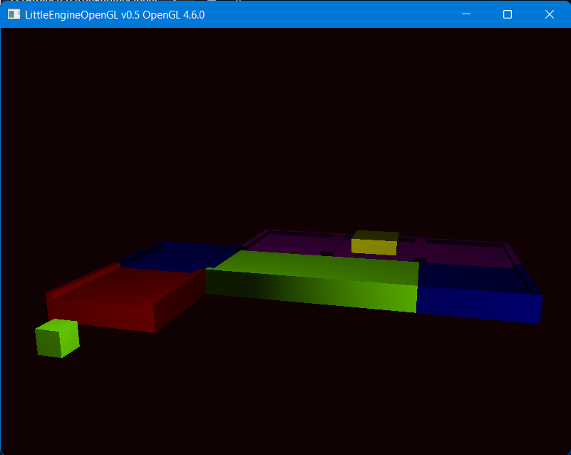
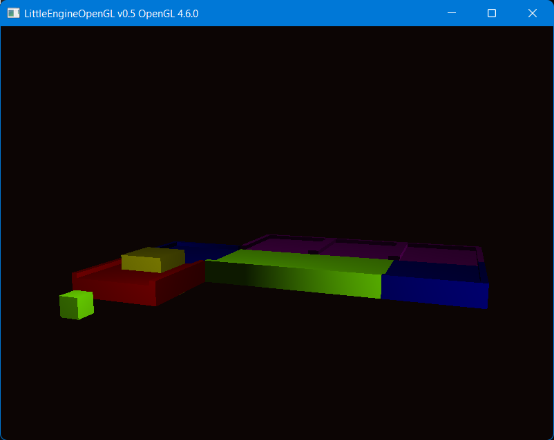
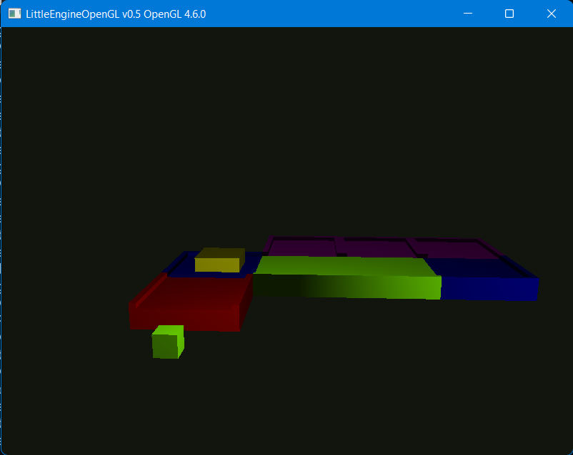

# LittleEngineOpenGL

Quick project made with OpenGL for AGH University of Science and Technology. It renders cube, which travels from starting place to parking spot. Code is written so that it can be easily understood with ClassSpecification and class.init(ClassSpecs) manner.

## Images

<p align="center">
  
</p>

<p align="center">
  
</p>

<p align="center">
  
</p>

## Authors

Mateusz Rzeczyca

## Code Examples

### Window

```cpp
    le::WindowSpecification windowSpecs;
    windowSpecs.width = 800;
    windowSpecs.height = 600;
    windowSpecs.name = "LittleEngineOpenGL v0.5 OpenGL 4.6.0";
    windowSpecs.aspectRatio = (f32)windowSpecs.width / (f32)windowSpecs.height;

    le::Window window;
    window.init(windowSpecs);

    // Code...

    window.close();
```

### Camera

```cpp
    le::CameraSpecification camSpecs;
    camSpecs.aspectRatio = windowSpecs.aspectRatio;
    camSpecs.position = { 3.f, 2.f, 3.f };
    camSpecs.worldUp = { 0.f, 1.f, 0.f };
    camSpecs.front = { 0.f, 0.f, -1.f };
    camSpecs.yaw = -90.f;
    camSpecs.pitch = 0.f;
    camSpecs.movementSpeed = 2.5f;
    camSpecs.sensitivity = 0.1f;
    camSpecs.zoom = 45.f;
    camSpecs.near = 0.1f;
    camSpecs.far = 100.f;

    le::Camera camera;
    camera.init(camSpecs);
    window.updateCallbacksForCamera(&camera);

    // Code...
```

### Buffer

```cpp
    le::Cube cube;

    le::BufferSpecification bufferSpecsCube;
    bufferSpecsCube.pVertices = cube.vertices();
    bufferSpecsCube.countVertices = cube.countVertices();
    bufferSpecsCube.sizeofVertices = cube.sizeofVertices();
    bufferSpecsCube.pIndices = cube.indices();
    bufferSpecsCube.countIndices = cube.countIndices();
    bufferSpecsCube.sizeofIndices = cube.sizeofIndices();

    le::Buffer bufferCube;
    bufferCube.init(bufferSpecsCube);
```

### Shader

```cpp
    le::ShaderInfo vertexShader;
    vertexShader.type = le::ShaderType::VERTEX;
    vertexShader.path = "resources/default.vertex.glsl";

    le::ShaderInfo fragmentShader;
    fragmentShader.type = le::ShaderType::FRAGMENT;
    fragmentShader.path = "resources/default.fragment.glsl";

    le::ShaderSpecification shaderSpecs;
    shaderSpecs.infos = { vertexShader, fragmentShader };

    le::Shader shader;
    shader.init(shaderSpecs);
    shader.use();

    // Code...

    shader.close();
```

### PointLight

```cpp
    le::PointLightSpecification pointLightSpecs;
    pointLightSpecs.position = { 2.f, 2.f, 1.f };
    pointLightSpecs.color = { 0.5f, 1.f, 0.5f };

    le::PointLight pointLight(pointLightSpecs);

    // Code...
```

### UniformSetupFunc

```cpp
    auto uniformSetupFunc = [](le::Camera* pCamera, le::Shader* pShader, le::MeshRuntimeSpecification* pMeshSpecs,
                               le::PointLight* pPointLight) {
        const le::mat4 objectMatrix =
            le::mat4::translation(pMeshSpecs->position) *
            le::mat4::rotation(pMeshSpecs->rotateFunc(pMeshSpecs->angle), pMeshSpecs->rotation) *
            le::mat4::scale(pMeshSpecs->scale);
        const le::mat4 objectSeenThroughCameraMatrix =
            pCamera->getProjectionMatrix() *
            pCamera->getViewMatrix() *
            pCamera->getModelMartix() *
            objectMatrix;

        // Vertex Uniforms
        pShader->setMat4("uModel", pCamera->getModelMartix());
        pShader->setMat4("uObjectMatrix", objectMatrix);
        pShader->setMat4("uTransform", objectSeenThroughCameraMatrix);
        // Fragment Uniforms
        pShader->setVec4("uMeshColor", pMeshSpecs->color);
        pShader->setVec3("uLightColor", pPointLight->getColor());
        pShader->setVec3("uLightPosition", pPointLight->getPosition());
        pShader->setVec3("uCameraPosition", pCamera->getPositionVec());
    };
```

### MeshRuntimeSpecification

```cpp
    MeshRuntimeSpecification meshRunSpecs;
    meshRunSpecs.position = carSpecs.position;
    meshRunSpecs.rotation = carSpecs.rotation;
    meshRunSpecs.scale = carSpecs.scale;
    meshRunSpecs.color = carSpecs.color;
    meshRunSpecs.rotateFunc = rotationFunction;
    meshRunSpecs.angle = carSpecs.angle;
    meshRunSpecs.type = carSpecs.type;
```

### Renderer

```cpp
    le::RendererSpecification renderSpecs;
    renderSpecs.clearColor = le::color4{ 0.2f, 0.3f, 0.7f, 1.f };
    renderSpecs.pCamera = &camera;

    le::Renderer renderer;
    renderer.init(renderSpecs);

    // Code...

    le::RenderModelSpecification renderModelSpecs;
    renderModelSpecs.pShader = &shader;
    renderModelSpecs.pBuffer = &bufferCube;
    renderModelSpecs.pPointLight = &pointLight;
    renderModelSpecs.pUniformSetupFunc = uniformSetupFunc;
    renderModelSpecs.pMeshSpecs = &carMeshRuntimeSpecs;

    renderer.draw(renderModelSpecs);
```
